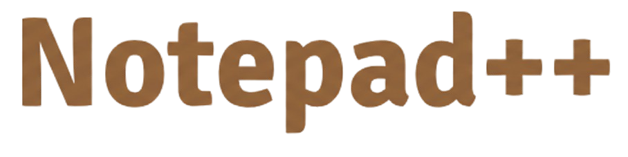

<p align="center">
  
</p>

<h1 align="center">Notepad-plusplus</h1>
<p align="center">A modern, feature-rich note-taking application.</p>

<p align="center">
  
  
  
  
  
  
</p>

## Description
This project is a modern note-taking application built with a focus on rich text editing and a clean user interface. It provides functionalities for creating, managing, and viewing notes through a dashboard, leveraging Tiptap for advanced content editing and Supabase for backend services.

## ✨ Features
*   **Rich Text Editor:** Comprehensive editing features including bold, italic, underline, strikethrough, code blocks, blockquotes, ordered/unordered lists, checklists, multiple heading levels, and horizontal rules.
*   **Text Formatting:** Support for text alignment (left, center, right, justify) and text highlighting.
*   **Media Embedding:** Ability to upload and embed images directly into notes.
*   **Link Management:** Easy insertion, editing, and removal of hyperlinks.
*   **Undo/Redo:** Full control over content changes with undo and redo history.
*   **Note Management:** Dedicated pages for creating, viewing, and organizing notes.
*   **Dashboard View:** A centralized dashboard for an overview of your notes.
*   **Theme Toggle:** Switch between light and dark modes for preferred viewing.

## 🚀 Installation
To get a local copy up and running, follow these simple steps.

1.  **Clone the repository:**
    ```bash
    git clone https://github.com/your-username/Notepad-plusplus.git
    cd Notepad-plusplus
    ```
    *(Replace `your-username/Notepad-plusplus.git` with the actual repository URL)*

2.  **Install dependencies:**
    ```bash
    npm install
    ```

3.  **Run the development server:**
    ```bash
    npm run dev
    ```
    The application will typically start on `http://localhost:5173`.

## 🛠️ Tech Stack
*   **Languages:** TypeScript, SCSS, CSS, JavaScript, HTML
*   **Frontend Framework:** React
*   **Build Tool:** Vite
*   **Rich Text Editor Library:** Tiptap
*   **Linting:** ESLint

## 📂 Project Structure
```
.
├── components.json
├── index.html
├── public/
│   ├── google.png
│   └── vite.svg
└── src/
    ├── App.css
    ├── App.tsx
    ├── Pages/
    │   ├── CreateNote.tsx
    │   ├── Dashboard.tsx
    │   ├── Landing.tsx
    │   └── Note.tsx
    ├── assets/
    │   ├── Gemini_Generated_Image_wxyh3ewxyh3ewxyh-removebg-preview.png
    │   ├── google.png
    │   └── react.svg
    ├── components/
    │   ├── tiptap-extension/
    │   │   └── node-background-extension.ts
    │   ├── tiptap-icons/
    │   │   ├── align-center-icon.tsx
    │   │   ├── blockquote-icon.tsx
    │   │   ├── bold-icon.tsx
    │   │   └── ... (many more icon components)
    │   ├── tiptap-node/
    │   │   ├── blockquote-node/ (...)
    │   │   ├── code-block-node/ (...)
    │   │   ├── heading-node/ (...)
    │   │   ├── horizontal-rule-node/ (...)
    │   │   ├── image-node/ (...)
    │   │   ├── image-upload-node/ (...)
    │   │   ├── list-node/ (...)
    │   │   └── paragraph-node/ (...)
    │   ├── tiptap-templates/
    │   │   └── simple/
    │   │       ├── data/
    │   │       ├── simple-editor.scss
    │   │       ├── simple-editor.tsx
    │   │       └── theme-toggle.tsx
    │   ├── tiptap-ui-primitive/
    │   │   ├── badge/ (...)
    │   │   ├── button/ (...)
    │   │   ├── card/ (...)
    │   │   └── ... (many more UI primitive components)
    │   ├── tiptap-ui/
    │   │   ├── blockquote-button/ (...)
    │   │   ├── code-block-button/ (...)
    │   │   ├── color-highlight-button/ (...)
    │   │   └── ... (many more Tiptap UI components)
    │   └── ui/
    │       └── comic-text.tsx
    ├── hooks/
    │   ├── use-composed-ref.ts
    │   ├── use-cursor-visibility.ts
    │   ├── use-element-rect.ts
    │   └── ... (many more custom hooks)
    ├── index.css
    ├── lib/
    │   ├── supabase.ts
    │   ├── tiptap-utils.ts
    │   └── utils.ts
    ├── main.tsx
    └── styles/
        ├── _keyframe-animations.scss
        └── _variables.scss
```
